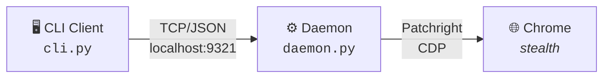

# patchright-cli

[](https://pypi.org/project/patchright-cli/)
[](https://pypi.org/project/patchright-cli/)
[](https://pypi.org/project/patchright-cli/)
[](LICENSE)
[](https://github.com/AhaiMk01/patchright-cli/actions)
[](https://github.com/AhaiMk01/patchright-cli)
[](https://github.com/AhaiMk01/patchright-cli/issues)
[](https://github.com/astral-sh/ruff)

Anti-detect browser automation CLI. Same command interface as [Microsoft's playwright-cli](https://github.com/microsoft/playwright-cli) but using [Patchright](https://github.com/kaliiiiiiiiii/patchright-python) (undetected Playwright fork) to bypass bot detection.

> **One-liner:** `uvx patchright-cli open https://protected-site.com`

### Highlights

| | Feature |
|---|---|
| :shield: | Bypasses Akamai, Cloudflare, and other anti-bot systems |
| :rocket: | Same command interface as playwright-cli — zero learning curve |
| :robot: | Built for AI agents (Claude Code, Codex, etc.) with YAML snapshots |
| :zap: | Daemon architecture — browser stays open between commands |
| :package: | `pip install` / `uvx` — no Docker, no config files |
| :lock: | Persistent profiles for maintaining login sessions |

---

## Install

> [!TIP]
> **Just paste this into your AI coding agent — it will do the rest:**
>
> ```
> Install and set up patchright-cli by following the instructions here:
> https://raw.githubusercontent.com/AhaiMk01/patchright-cli/main/docs/installation.md
> ```
>
> Your agent handles the install, browser setup, and skill configuration automatically.

<details>
<summary><b>For LLM Agents</b></summary>

```bash
curl -s https://raw.githubusercontent.com/AhaiMk01/patchright-cli/main/docs/installation.md
```

</details>

<details>
<summary><b>Manual Install</b></summary>

> [!IMPORTANT]
> **Requirements:** Python 3.10+ and Google Chrome

```bash
# 1. Install the package
pip install patchright-cli        # or: uv tool install patchright-cli

# 2. Install the Patchright browser (fallback if Chrome is not found)
python -m patchright install chromium

# 3. Verify
patchright-cli open https://example.com
patchright-cli close
```

Or run without installing (like npx):

```bash
uvx patchright-cli open https://example.com
```

**From source:**

```bash
git clone https://github.com/AhaiMk01/patchright-cli.git
cd patchright-cli
uv venv && uv pip install -e .
python -m patchright install chromium
```

</details>

---

## Quick Start

```bash
# Launch undetected Chrome and navigate
patchright-cli open https://example.com

# Take a snapshot to see interactive elements with refs
patchright-cli snapshot

# Interact using refs from the snapshot
patchright-cli click e2
patchright-cli fill e5 "search query"
patchright-cli press Enter

# Take a screenshot
patchright-cli screenshot

# Close the browser
patchright-cli close
```

---

## Architecture



| Component | Role |
|-----------|------|
| **Daemon** (`daemon.py`) | Long-running process managing browser sessions via Patchright. Auto-starts on first `open`. |
| **CLI** (`cli.py`) | Thin client — connects, sends command, prints result, disconnects. Browser stays open. |
| **Snapshot** (`snapshot.py`) | `TreeWalker`-based DOM scan assigning `data-patchright-ref` attributes for element targeting. |

---

<details>
<summary><h2>📖 Commands</h2></summary>

### Core
```bash
patchright-cli open [url]              # Launch browser
patchright-cli open --persistent       # With persistent profile
patchright-cli goto <url>              # Navigate
patchright-cli click <ref>             # Click element
patchright-cli dblclick <ref>          # Double-click
patchright-cli fill <ref> <value>      # Fill text input
patchright-cli type <text>             # Type via keyboard
patchright-cli hover <ref>             # Hover over element
patchright-cli select <ref> <value>    # Select dropdown option
patchright-cli check <ref>             # Check checkbox
patchright-cli uncheck <ref>           # Uncheck checkbox
patchright-cli drag <from> <to>        # Drag and drop
patchright-cli snapshot                # Accessibility snapshot
patchright-cli snapshot --filename=f   # Save to custom path
patchright-cli eval <expr>             # Run JavaScript
patchright-cli screenshot              # Full page screenshot
patchright-cli screenshot <ref>        # Element screenshot
patchright-cli screenshot --filename=f # Save to custom path
patchright-cli close                   # Close session
```

### Navigation
```bash
patchright-cli go-back
patchright-cli go-forward
patchright-cli reload
```

### Keyboard / Mouse
```bash
patchright-cli press Enter
patchright-cli keydown Shift
patchright-cli keyup Shift
patchright-cli mousemove 150 300
patchright-cli mousedown [button]
patchright-cli mouseup [button]
patchright-cli mousewheel 0 100
```

### Dialog
```bash
patchright-cli dialog-accept [text]    # Accept next alert/confirm/prompt
patchright-cli dialog-dismiss          # Dismiss next dialog
```

### Upload / Resize
```bash
patchright-cli upload ./file.pdf       # Upload to first file input
patchright-cli upload ./file.pdf e5    # Upload to specific input
patchright-cli resize 1920 1080        # Resize viewport
```

### Tabs
```bash
patchright-cli tab-list
patchright-cli tab-new [url]
patchright-cli tab-select <index>
patchright-cli tab-close [index]
```

### State Persistence
```bash
patchright-cli state-save [file]       # Save cookies + localStorage
patchright-cli state-load <file>       # Restore saved state
```

### Storage
```bash
# Cookies
patchright-cli cookie-list
patchright-cli cookie-list --domain=example.com
patchright-cli cookie-get <name>
patchright-cli cookie-set <name> <value>
patchright-cli cookie-set <name> <value> --domain=example.com --httpOnly --secure
patchright-cli cookie-delete <name>
patchright-cli cookie-clear

# localStorage
patchright-cli localstorage-list
patchright-cli localstorage-get <key>
patchright-cli localstorage-set <key> <value>
patchright-cli localstorage-delete <key>
patchright-cli localstorage-clear

# sessionStorage
patchright-cli sessionstorage-list
patchright-cli sessionstorage-get <key>
patchright-cli sessionstorage-set <key> <value>
patchright-cli sessionstorage-delete <key>
patchright-cli sessionstorage-clear
```

### Request Mocking
```bash
patchright-cli route "**/*.jpg" --status=404
patchright-cli route "https://api.example.com/**" --body='{"mock":true}'
patchright-cli route-list
patchright-cli unroute "**/*.jpg"
patchright-cli unroute                 # Remove all routes
```

### Tracing / PDF
```bash
patchright-cli tracing-start
patchright-cli tracing-stop            # Saves .zip trace file
patchright-cli pdf --filename=page.pdf
```

### DevTools
```bash
patchright-cli console                 # All console messages
patchright-cli console warning         # Filter by level
patchright-cli network                 # Network request log
```

### Sessions
```bash
patchright-cli -s=mysession open https://example.com --persistent
patchright-cli -s=mysession click e6
patchright-cli -s=mysession close
patchright-cli list                    # List all sessions
patchright-cli close-all
patchright-cli kill-all
patchright-cli delete-data             # Delete persistent profile
```

</details>

---

## Snapshots

After each state-changing command, the CLI outputs page info and a YAML snapshot:

```
### Page
- Page URL: https://example.com/
- Page Title: Example Domain
### Snapshot
[Snapshot](.patchright-cli/page-1774376207818.yml)
```

The snapshot lists interactive elements with refs you can use in commands:

```yaml
- ref: e1
  role: heading
  name: Example Domain
  level: 1
- ref: e2
  role: link
  name: Learn more
  url: "https://iana.org/domains/example"
```

> [!NOTE]
> Use refs directly: `patchright-cli click e2`, `patchright-cli fill e5 "text"`

---

## Anti-Detect Features

> [!CAUTION]
> This tool is for **authorized testing, security research, and legitimate automation** only.

- :white_check_mark: Real Chrome browser (not Chromium)
- :white_check_mark: Patchright patches `navigator.webdriver` and other detection vectors
- :white_check_mark: Persistent profiles maintain cookies/sessions across runs
- :white_check_mark: No custom user-agent or headers (natural fingerprint)
- :white_check_mark: Headed by default (headless is more detectable)

---

## Agent Integration

Works with any AI coding agent that supports SKILL.md skills:

| Agent | Install skill |
|-------|--------------|
| **Claude Code** | `mkdir -p ~/.claude/skills/patchright-cli && curl -sL https://raw.githubusercontent.com/AhaiMk01/patchright-cli/main/skills/patchright-cli/SKILL.md -o ~/.claude/skills/patchright-cli/SKILL.md` |
| **OpenClaw** | `mkdir -p ~/.openclaw/skills/patchright-cli && curl -sL https://raw.githubusercontent.com/AhaiMk01/patchright-cli/main/skills/patchright-cli/SKILL.md -o ~/.openclaw/skills/patchright-cli/SKILL.md` |
| **Codex CLI** | `mkdir -p ~/.codex/skills/patchright-cli && curl -sL https://raw.githubusercontent.com/AhaiMk01/patchright-cli/main/skills/patchright-cli/SKILL.md -o ~/.codex/skills/patchright-cli/SKILL.md` |
| **Gemini CLI** | `mkdir -p ~/.gemini/skills/patchright-cli && curl -sL https://raw.githubusercontent.com/AhaiMk01/patchright-cli/main/skills/patchright-cli/SKILL.md -o ~/.gemini/skills/patchright-cli/SKILL.md` |
| **OpenCode** | `mkdir -p ~/.opencode/skills/patchright-cli && curl -sL https://raw.githubusercontent.com/AhaiMk01/patchright-cli/main/skills/patchright-cli/SKILL.md -o ~/.opencode/skills/patchright-cli/SKILL.md` |
| **Cursor** | Copy SKILL.md to `.cursor/skills/patchright-cli/` in your project |
| **Windsurf** | Copy SKILL.md to `.windsurf/skills/patchright-cli/` in your project |
| **Aider** | Copy SKILL.md to `.aider/skills/patchright-cli/` in your project |

Or just tell your agent:

> Install patchright-cli skill from https://raw.githubusercontent.com/AhaiMk01/patchright-cli/main/skills/patchright-cli/SKILL.md

---

## Star History

<a href="https://star-history.com/#AhaiMk01/patchright-cli&Date">
 <picture>
   <source media="(prefers-color-scheme: dark)" srcset="https://api.star-history.com/svg?repos=AhaiMk01/patchright-cli&type=Date&theme=dark" />
   <source media="(prefers-color-scheme: light)" srcset="https://api.star-history.com/svg?repos=AhaiMk01/patchright-cli&type=Date" />
   
 </picture>
</a>

---

## License

Apache 2.0 — same as [playwright-cli](https://github.com/microsoft/playwright-cli)
